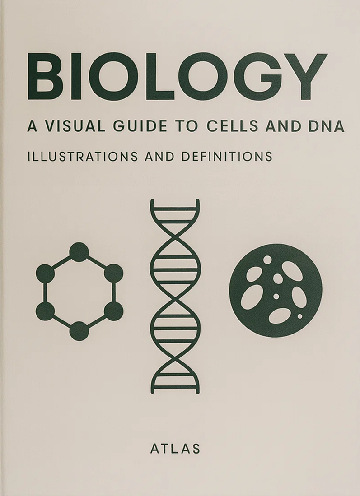

# Cell Biology — Interactive Visual Textbook

An interactive, visually engaging educational resource for learning cell biology through detailed diagrams, comprehensive glossary, and downloadable materials. Designed to make complex cellular structures accessible and memorable for students and educators.



## 🌟 Features

- **Interactive Diagrams**: High-quality, labeled illustrations of cellular organelles and processes
- **Comprehensive Glossary**: Expandable definitions with audio playback for accessibility
- **Visual Learning**: Color-coded categories and intuitive navigation
- **Downloadable Resources**: Generate and download PDF versions of figures
- **Responsive Design**: Optimized for desktop and mobile learning
- **Accessibility Features**: Speech synthesis for glossary terms, larger text options

## 🛠️ Tech Stack

- **Frontend**: React 18 with TypeScript
- **Build Tool**: Vite
- **Styling**: Tailwind CSS with custom gradients and themes
- **UI Components**: Radix UI primitives
- **Animations**: Motion library
- **Icons**: Lucide React
- **PDF Generation**: jsPDF
- **Notifications**: Sonner

## 🚀 Installation

1. **Clone the repository**
   ```bash
   git clone https://github.com/austncarsn/biology-virtual-textbook.git
   cd biology-virtual-textbook
